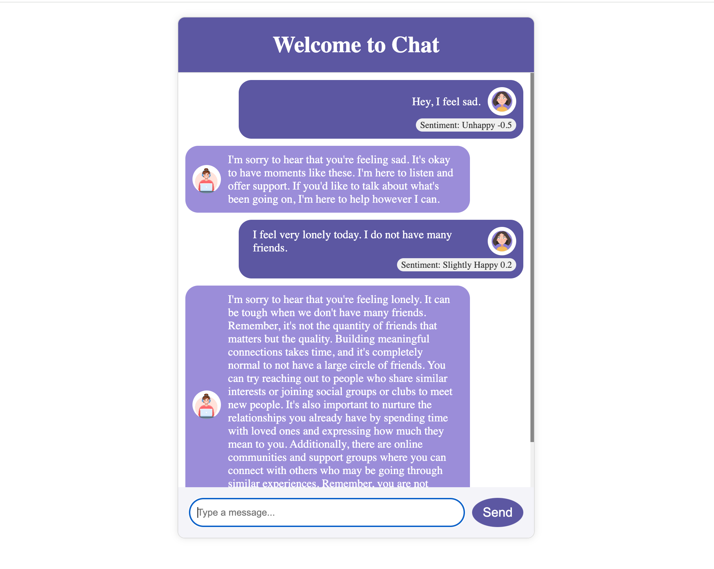
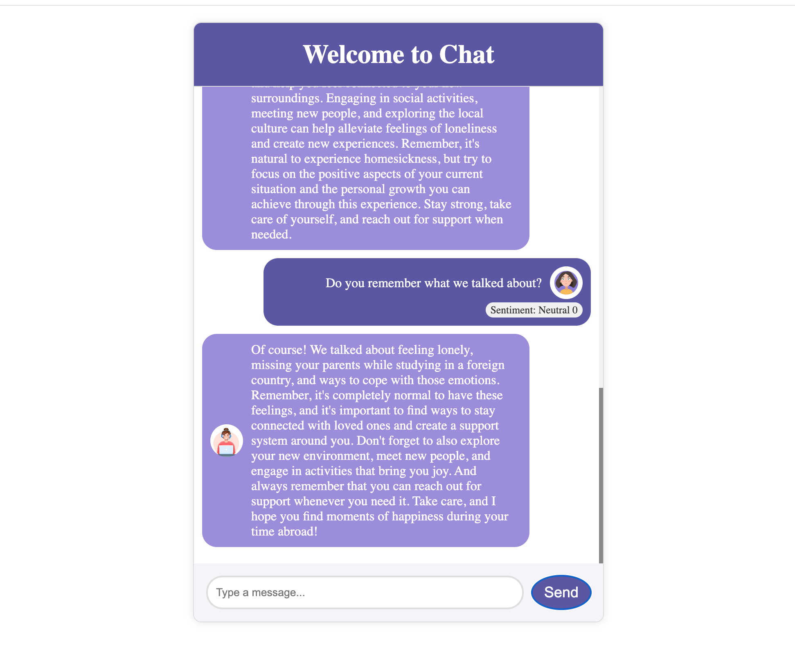

# Sentiment-Enhanced ChatGPT

Sentiment-Enhanced ChatGPT is a state-of-the-art chatbot built on OpenAI's GPT-3.5 model. It's designed to understand and respond to user sentiment, creating a conversational experience that's attuned to the user's emotional state. This chatbot is perfect for customer support, interactive engagement, and any scenario where understanding context and emotions is crucial.

## Features

- **Sentiment Analysis**: Interprets the emotional tone from user inputs to tailor responses accordingly.
- **GPT-3.5 Integration**: Utilizes OpenAI's powerful language model for generating human-like text.
- **Persistent Context**: Maintains conversational context for meaningful and continuous interaction.
- **Customizable Personality**: Adjusts its personality and tone based on the sentiment of the conversation.

## Table of Contents

- [Preview](#preview)
- [How It Works](#how-it-works)

## Preview

_The above image showcases the Sentiment-Enhanced ChatGPT in action._

## How It Works

### Sentiment Analysis and Response Generation

The core of Sentiment-Enhanced ChatGPT is the integration of OpenAI's GPT-3.5 model with advanced sentiment analysis. This chatbot evaluates the emotional tone of user inputs using sentiment analysis and employs prompt engineering to tailor the prompts sent to the GPT-3.5 model. This ensures that the responses are not only contextually relevant but also empathetically aligned with the user's emotional state.

### Prompt Engineering

Prompt engineering is key in shaping the AI's responses to be sensitive to the user's mood. By designing input prompts influenced by sentiment analysis, the chatbot dynamically adapts to a wide range of emotional contexts, offering a natural and engaging user experience.

### Conversation Context and History

A standout feature of Sentiment-Enhanced ChatGPT is its ability to remember past conversations. The system stores chat history, allowing it to maintain context over multiple interactions. This persistent memory feature enables the chatbot to provide responses that are not just relevant to the current conversation but also aware of past interactions, leading to a more coherent and connected conversational experience.

The chat history is stored securely, ensuring that each interaction with the user is both private and personalized. This feature enhances the chatbot's utility in scenarios where ongoing conversations are essential, such as customer support, personalized assistance, or any long-term interaction.

